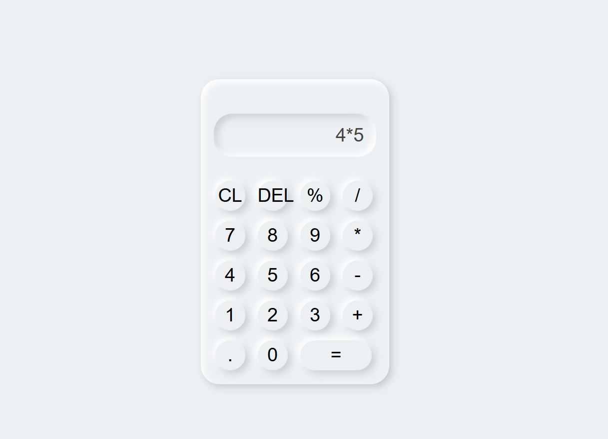

# 🧮 Calculator
A simple, responsive **Calculator App** built using **HTML, CSS, and JavaScript**.  
It supports basic arithmetic operations such as addition, subtraction, multiplication, and division.

##  Screenshot

  

##  Features
- ➕ Addition, ➖ Subtraction, ✖ Multiplication, ➗ Division  
- Delete (backspace) support  
-  Clear button to reset screen  
-  Real-time calculation with JavaScript `eval()`  
-  Responsive design  

##  Technologies Used
- **HTML5** – Structure  
- **CSS3** – Styling  
- **JavaScript (ES6)** – Functionality  

##  Project Structure
calculator/
│── index.html # Main calculator interface
│── style.css # Styling for the calculator
│── screenshot.png # App preview image

##  Future Improvements
- Add keyboard input support 
- Add history of calculations 
- Add dark & light themes 